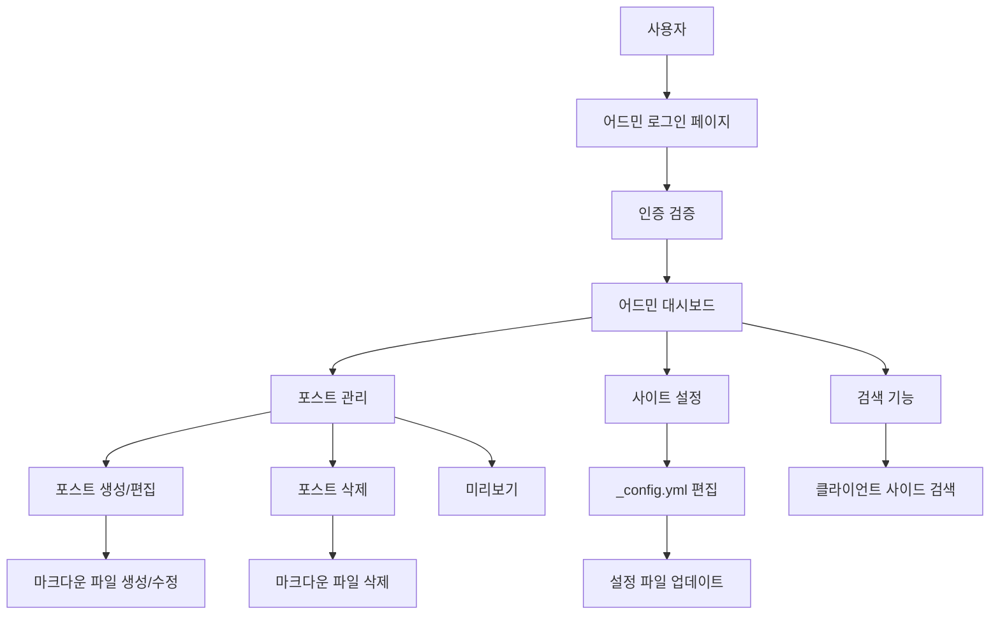

# 디자인 문서

## 개요

Jekyll 블로그에 클라이언트 사이드 어드민 인터페이스를 추가하는 시스템입니다. GitHub Pages 환경에서 작동하며, 정적 파일 기반으로 블로그 포스트와 사이트 설정을 관리할 수 있습니다. 인증은 환경변수에 저장된 관리자 계정을 사용하여 클라이언트 사이드에서 처리됩니다.

## 아키텍처

### 전체 시스템 구조



### 기술 스택

- **프론트엔드**: HTML5, CSS3, Vanilla JavaScript
- **스타일링**: Jekyll의 기본 Sass 처리 활용
- **마크다운 처리**: Marked.js 라이브러리
- **파일 처리**: File System Access API (지원되는 브라우저) 또는 다운로드/업로드 방식
- **인증**: 클라이언트 사이드 환경변수 기반 인증
- **배포**: GitHub Pages 호환

## 컴포넌트 및 인터페이스

### 1. 인증 시스템

#### AuthManager 클래스
```javascript
class AuthManager {
  constructor() {
    this.adminId = 'id';
    this.adminPw = 'pw';
    this.isAuthenticated = false;
  }
  
  login(id, password) { /* 인증 로직 */ }
  logout() { /* 로그아웃 로직 */ }
  checkAuth() { /* 인증 상태 확인 */ }
}
```

### 2. 포스트 관리 시스템

#### PostManager 클래스
```javascript
class PostManager {
  constructor() {
    this.posts = [];
    this.currentPost = null;
  }
  
  loadPosts() { /* 포스트 목록 로드 */ }
  createPost(postData) { /* 새 포스트 생성 */ }
  updatePost(id, postData) { /* 포스트 업데이트 */ }
  deletePost(id) { /* 포스트 삭제 */ }
  searchPosts(query) { /* 포스트 검색 */ }
}
```

#### Post 데이터 구조
```javascript
{
  id: 'unique-id',
  filename: '2025-08-05-post-title.markdown',
  frontMatter: {
    layout: 'post',
    title: 'Post Title',
    date: '2025-08-05 10:27:35 +0900',
    categories: ['jekyll', 'update']
  },
  content: 'Post content in markdown...',
  lastModified: '2025-08-05T10:27:35.000Z'
}
```

### 3. 설정 관리 시스템

#### ConfigManager 클래스
```javascript
class ConfigManager {
  constructor() {
    this.config = {};
  }
  
  loadConfig() { /* _config.yml 로드 */ }
  updateConfig(newConfig) { /* 설정 업데이트 */ }
  validateConfig(config) { /* YAML 유효성 검사 */ }
}
```

### 4. 파일 시스템 인터페이스

#### FileSystemManager 클래스
```javascript
class FileSystemManager {
  constructor() {
    this.supportsFileSystemAccess = 'showDirectoryPicker' in window;
  }
  
  async readFile(path) { /* 파일 읽기 */ }
  async writeFile(path, content) { /* 파일 쓰기 */ }
  async deleteFile(path) { /* 파일 삭제 */ }
  async listFiles(directory) { /* 파일 목록 */ }
}
```

### 5. UI 컴포넌트

#### 페이지 구조
- `/admin/` - 로그인 페이지
- `/admin/dashboard/` - 메인 대시보드
- `/admin/posts/` - 포스트 관리
- `/admin/posts/new/` - 새 포스트 작성
- `/admin/posts/edit/:id` - 포스트 편집
- `/admin/settings/` - 사이트 설정

#### UI 컴포넌트 계층
```
AdminApp
├── LoginForm
├── Dashboard
│   ├── PostList
│   │   ├── SearchBar
│   │   ├── PostItem
│   │   └── Pagination
│   ├── PostEditor
│   │   ├── MarkdownEditor
│   │   ├── PreviewPane
│   │   └── MetadataForm
│   └── SettingsPanel
│       ├── SiteConfigForm
│       └── ValidationMessages
└── Navigation
```

## 데이터 모델

### 포스트 메타데이터
```yaml
---
layout: post
title: "포스트 제목"
date: 2025-08-05 10:27:35 +0900
categories: [jekyll, update]
tags: [tag1, tag2]
author: "작성자"
excerpt: "포스트 요약"
published: true
---
```

### 사이트 설정 (_config.yml)
```yaml
title: "사이트 제목"
email: "이메일@example.com"
description: "사이트 설명"
baseurl: "/blog"
url: "https://username.github.io"
twitter_username: "username"
github_username: "username"
theme: minima
plugins:
  - jekyll-feed
  - jekyll-seo-tag
```

## 오류 처리

### 인증 오류
- 잘못된 자격증명: 오류 메시지 표시 및 재입력 요청
- 세션 만료: 자동 로그아웃 및 로그인 페이지 리디렉션

### 파일 시스템 오류
- 파일 읽기/쓰기 실패: 사용자에게 알림 및 재시도 옵션
- 권한 부족: 대체 방법 (다운로드/업로드) 제안
- 파일 형식 오류: 유효성 검사 및 오류 메시지

### 데이터 유효성 오류
- 잘못된 YAML 형식: 구문 오류 위치 표시
- 필수 필드 누락: 필드별 오류 메시지
- 날짜 형식 오류: 올바른 형식 예시 제공

### 네트워크 오류
- GitHub Pages 배포 지연: 변경사항 반영 시간 안내
- 브라우저 호환성: 지원되지 않는 기능에 대한 대체 방법

## 테스트 전략

### 단위 테스트
- AuthManager 인증 로직
- PostManager CRUD 작업
- ConfigManager YAML 파싱
- FileSystemManager 파일 작업

### 통합 테스트
- 로그인부터 포스트 작성까지 전체 플로우
- 포스트 검색 기능
- 설정 변경 및 저장

### 브라우저 호환성 테스트
- Chrome, Firefox, Safari, Edge
- 모바일 브라우저 (iOS Safari, Chrome Mobile)
- File System Access API 지원 여부별 테스트

### 사용성 테스트
- 반응형 디자인 검증
- 접근성 (WCAG 2.1 AA 준수)
- 키보드 네비게이션
- 스크린 리더 호환성

## 보안 고려사항

### 클라이언트 사이드 인증의 한계
- 자격증명이 클라이언트에 노출됨
- 실제 보안이 아닌 편의성 위주의 접근 제어
- GitHub Pages의 정적 호스팅 환경에서의 제약사항

### 완화 방안
- 관리자 페이지를 robots.txt에서 제외
- 복잡한 URL 구조로 우연한 접근 방지
- 세션 타임아웃 구현
- 중요한 작업 전 재인증 요구

## 성능 최적화

### 로딩 성능
- 필요한 JavaScript만 지연 로딩
- CSS 최소화 및 압축
- 이미지 최적화

### 런타임 성능
- 가상 스크롤링으로 대량 포스트 목록 처리
- 검색 결과 캐싱
- 디바운싱을 통한 실시간 검색 최적화

### 메모리 관리
- 사용하지 않는 포스트 데이터 정리
- 이벤트 리스너 적절한 해제
- 대용량 파일 처리 시 청크 단위 처리

## 배포 및 유지보수

### GitHub Pages 배포
- Jekyll 빌드 프로세스와의 호환성
- 정적 파일로만 구성
- CDN을 통한 전역 배포

### 버전 관리
- 어드민 인터페이스 버전 표시
- 호환성 체크 및 업그레이드 가이드
- 설정 마이그레이션 스크립트

### 모니터링
- 클라이언트 사이드 오류 로깅
- 사용 패턴 분석 (개인정보 보호 준수)
- 성능 메트릭 수집